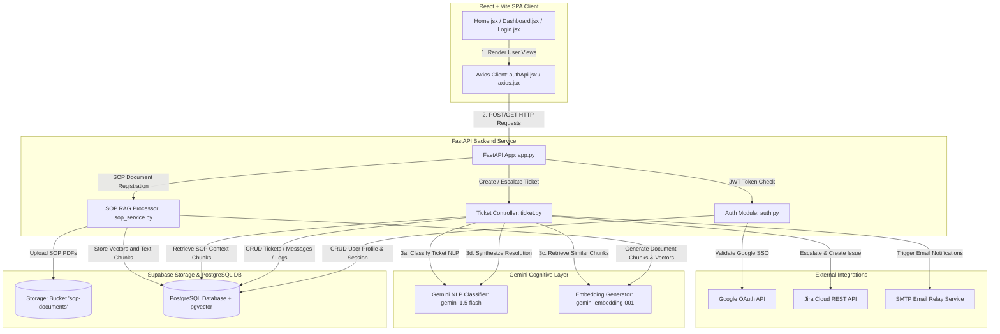
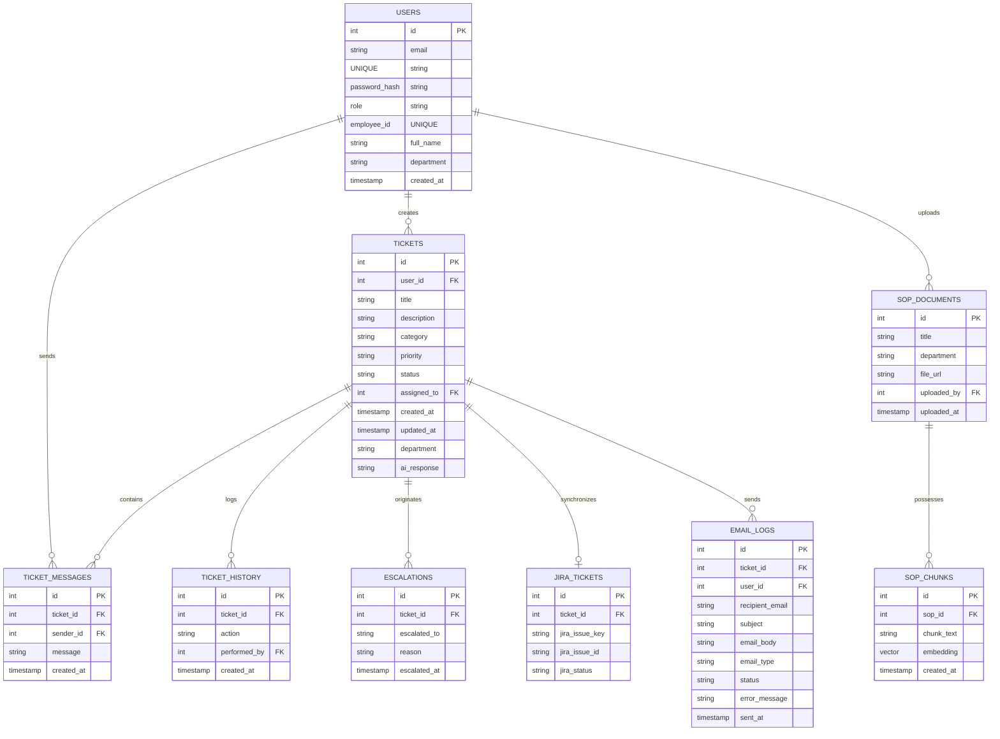
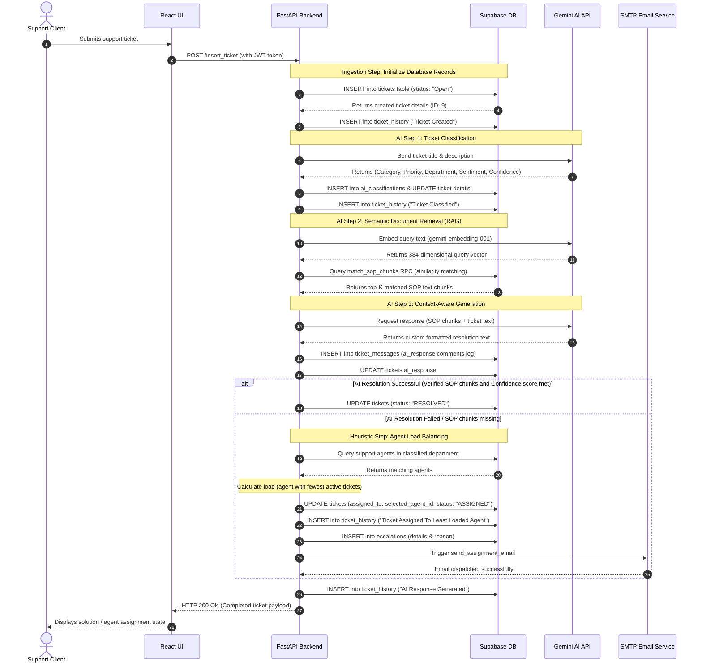

# System Architecture - AutoFlow AI Console

This document outlines the comprehensive system architecture, components, relational databases, integrations, and AI workflow patterns for the **AutoFlow AI support platform**.

---

## 1. System Architecture Overview

---

## 2. Component Design & Responsibilities

### A. Frontend Client (React + Vite)
- **Dashboard Console (`Dashboard.jsx`)**: The user's main application console. Manages query submission states, chat streams with the Gemini AI auto-resolver, ticket archives, ticket detail panels, comments logs, and system audit history trails.
- **Landing page (`Home.jsx`)**: An interactive showcase visualizer outlining the stages of vectorization, RAG queries, and autonomous ticket triaging.
- **Client API Bridge (`axios.jsx` & `authApi.jsx`)**: Intercepts outgoing requests to append Bearer JWT access tokens to request headers.

### B. Gateway Backend API (FastAPI)
- **FastAPI Core (`app/app.py`)**: Runs on Uvicorn, exposing REST APIs, enforcing security verification dependencies (`current_user`), and handling CORS rules.
- **Authentication Service (`auth/auth.py`)**: Signs/decodes JWT tokens, hashes client passwords securely via `bcrypt`, and handles Google SSO credential tokens.
- **SOP Ingestion Service (`rag/sop_service.py`)**: Extracts textual data from uploaded PDFs, segments text into semantic chunks, generates vector embeddings, and stores them in PostgreSQL.

### C. Persistent Database (Supabase PostgreSQL + pgvector)
- **Supabase Storage**: Hosts uploaded SOP files in the `sop-documents` bucket.
- **pgvector**: Indexes high-dimensional semantic vectors generated by the embedding model, supporting similarity search queries.

---

## 3. Database Schema Mapping

---

## 4. End-to-End AI Workflow Pipeline

The core AI engine runs a multi-stage **Cognitive & Ingestion Pipeline** when a ticket is created. This ensures the system resolves the ticket automatically if possible, or routes it with human agent load balancing.

---

## 5. Architectural Design Principles

- **Decoupled Fallback Orchestration**: If the Gemini API or the vector similarity search fails at any stage, the ticket ingestion is never blocked. The system logs the failure and automatically escalates the ticket to a human support agent.
- **Load-Balanced Human Handoff**: When a ticket cannot be resolved by the RAG pipeline, it query-checks active ticket workloads and routes the case to the least busy agent in the classified department.
- **Relational Integrity with Audit Trails**: Every state change (creation, classification, response synthesis, agent assignment, Jira escalations) logs a historical action record in the `ticket_history` table for telemetry.
