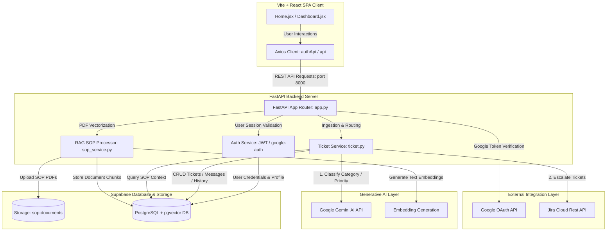
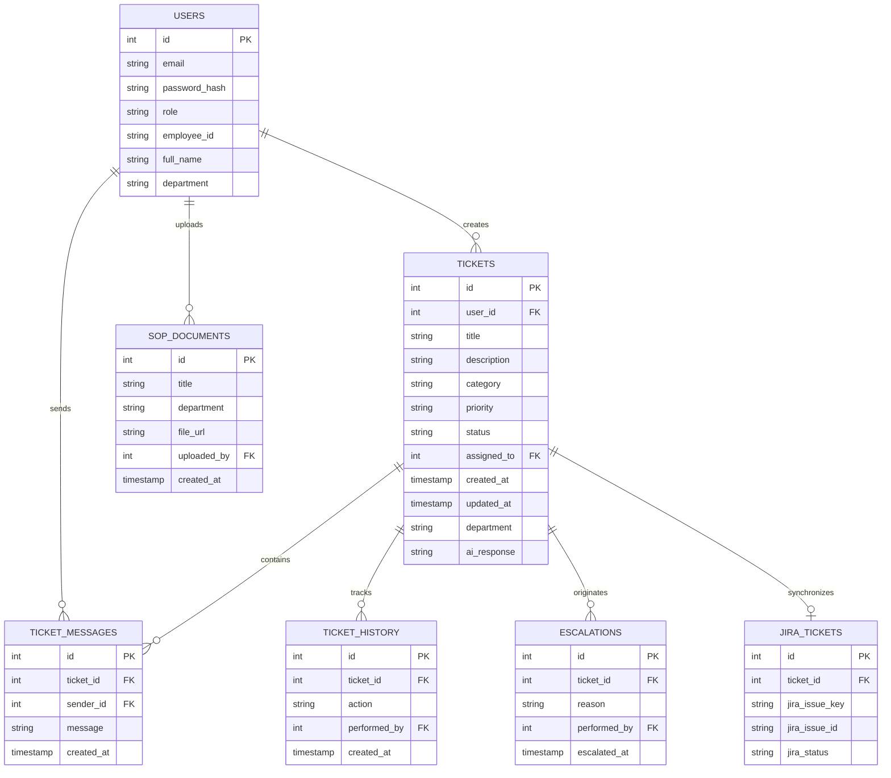
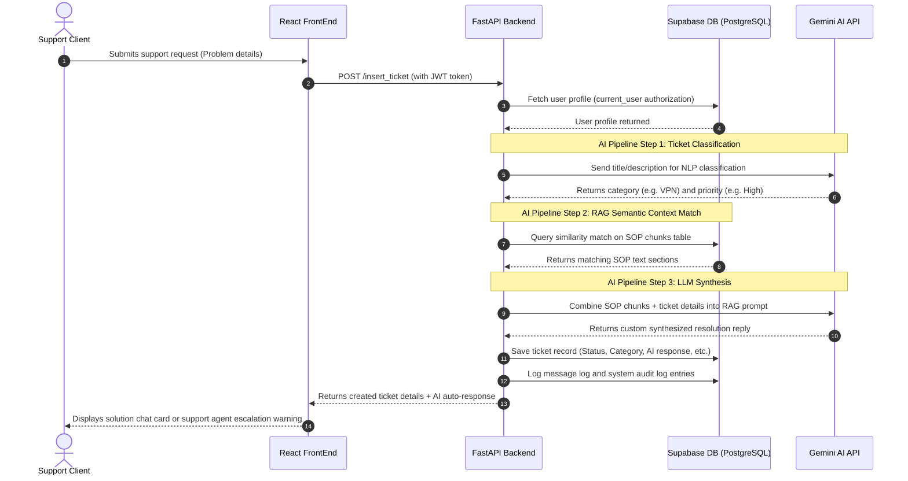

# System Architecture - AutoFlow AI Console

This md file  outlines the system architecture for the AutoFlow AI support platform.

---

## 1. System Architecture Overview

## 3. Database Schema Blueprint

---

## 4. End-to-End Ingestion & Processing Flow

